# NuFounders Platform

## Executive Summary

**NuFounders** is an AI-native workforce transformation platform specifically designed to empower displaced Black women through comprehensive upskilling, entrepreneurship pathways, and community support. The platform addresses a critical market opportunity: Black women represent one of the fastest-growing segments of entrepreneurs in the United States, yet face disproportionate barriers to accessing capital, training, and professional networks.

The platform combines cutting-edge artificial intelligence with human expertise to deliver personalized learning experiences, data-driven business formation support, and meaningful community connections. With a target of $30 million in revenue for 2026, NuFounders is positioned to become the premier destination for workforce reentry and entrepreneurship among displaced Black women.

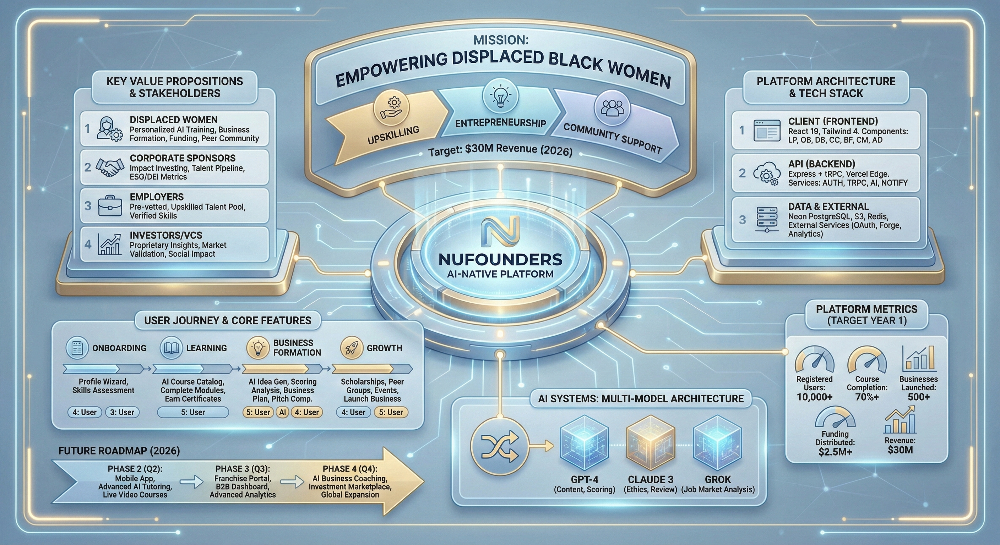

### Key Value Propositions

| Stakeholder | Value Delivered |
|-------------|-----------------|
| **Displaced Women** | Personalized AI-powered training, business formation support, funding access, and peer community |
| **Corporate Sponsors** | Impact investing opportunities, talent pipeline access, and ESG/DEI metric improvements |
| **Employers** | Pre-vetted, upskilled talent pool with verified competencies and soft skills |
| **Investors/VCs** | Proprietary data insights on workforce trends, market validation, and social impact metrics |

### Platform Metrics (Target Year 1)

| Metric | Target |
|--------|--------|
| Registered Users | 10,000+ |
| Course Completion Rate | 70%+ |
| Businesses Launched | 500+ |
| Funding Distributed | $2.5M+ |
| Corporate Sponsors | 25+ |
| Revenue | $30M |

---

## Table of Contents

1. [Platform Architecture](#platform-architecture)
2. [User Journey](#user-journey)
3. [Core Features](#core-features)
4. [AI Systems](#ai-systems)
5. [Database Architecture](#database-architecture)
6. [Role-Based Access Control](#role-based-access-control)
7. [Technical Stack](#technical-stack)
8. [API Documentation](#api-documentation)
9. [Deployment](#deployment)
10. [Future Roadmap](#future-roadmap)

---

## Platform Architecture

The NuFounders platform follows a modern, scalable architecture designed for rapid growth and AI-native operations.


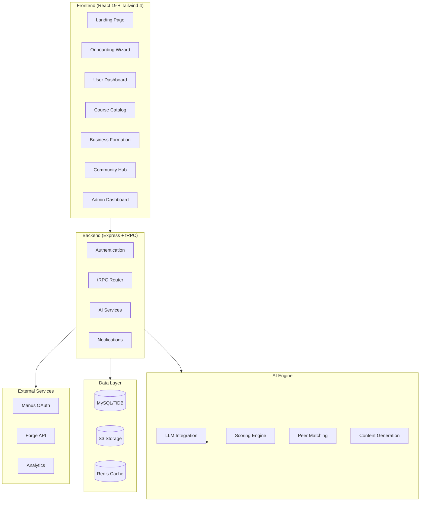

---

## User Journey

The platform guides users through a comprehensive journey from displacement to entrepreneurship success.


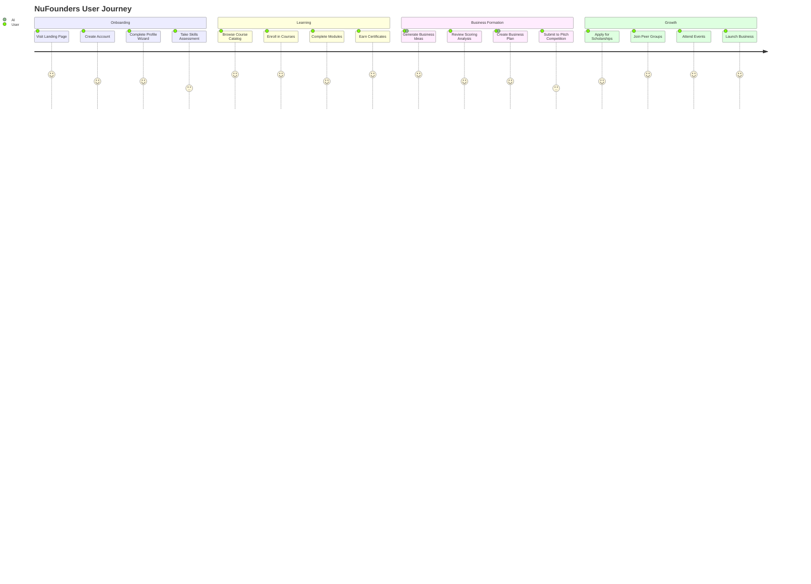

---

## Core Features

### 1. Multi-Step Onboarding Wizard

The onboarding process captures comprehensive user data to enable personalized recommendations.


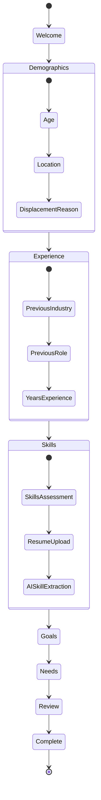

**Data Captured:**
- Demographics (age, location, displacement reason)
- Professional experience (industry, role, years)
- Skills inventory (self-reported + AI-extracted from resume)
- Business interests and goals
- Unmet needs for market validation
- Financial parameters (capital available, income goals)

### 2. AI-Powered Course Catalog

The platform offers 25+ courses across key categories, with 80% AI-generated content and 20% SME review.


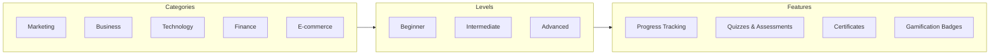

**Course Categories:**
| Category | Courses | Avg. Hours | Completion Rate |
|----------|---------|------------|-----------------|
| Marketing | 6 | 7.2 | 72% |
| Business | 8 | 8.5 | 68% |
| Technology | 5 | 8.8 | 65% |
| Finance | 3 | 8.0 | 76% |
| E-commerce | 3 | 12.0 | 58% |

### 3. Business Formation Pathway

AI-powered business idea generation and scoring helps users identify viable business opportunities.


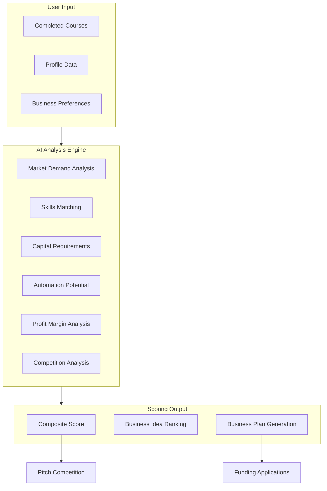

**Scoring Dimensions:**
| Dimension | Weight | Description |
|-----------|--------|-------------|
| Market Demand | 20% | Current and projected demand for the business vertical |
| Skills Match | 25% | Alignment between user skills and business requirements |
| Capital Requirements | 15% | Startup costs relative to user's available capital |
| Automation Potential | 15% | Opportunity for AI/tech-enabled efficiency |
| Profit Margin | 15% | Expected profitability based on industry benchmarks |
| Competition | 10% | Market saturation and competitive landscape |

### 4. Community Networking Hub

Peer matching uses vector similarity to connect users with compatible community members.


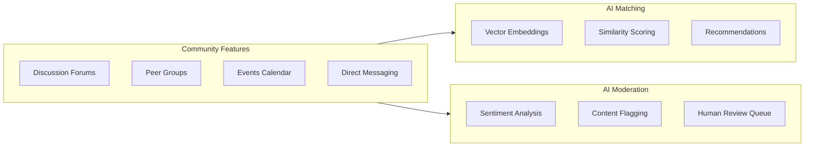

**Forum Categories:**
- Success Stories
- Questions & Answers
- Tips & Advice
- Events & Meetups
- Introductions
- Resources & Tools

### 5. Scholarship & Funding Management

Corporate sponsors can create and manage funding opportunities for platform users.


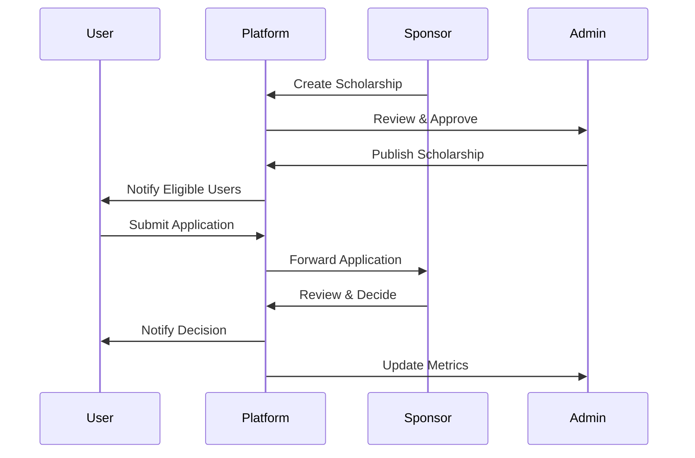

### 6. Pitch Competition System

Quarterly pitch competitions provide funding opportunities for promising business ideas.

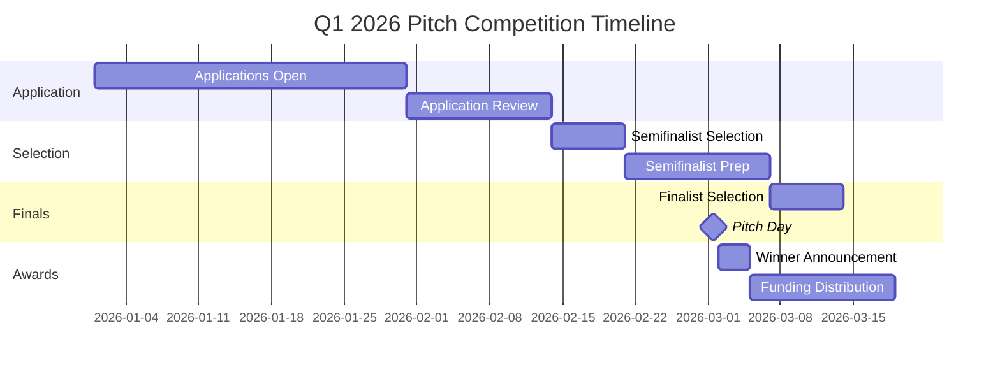

---

## AI Systems

### Multi-Model Architecture

NuFounders employs a multi-model AI architecture for different use cases:


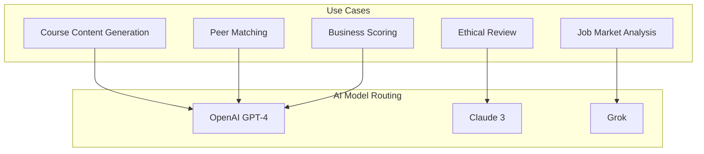

| Model | Primary Use | Strengths |
|-------|-------------|-----------|
| GPT-4 | Content generation, scoring | Comprehensive knowledge, creative output |
| Claude 3 | Ethical checks, content review | Safety-focused, nuanced analysis |
| Grok | Job market data, trends | Real-time data, market insights |

### AI Agent Architecture


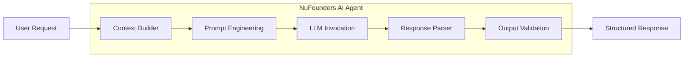

---

## Database Architecture


### Entity Relationship Diagram

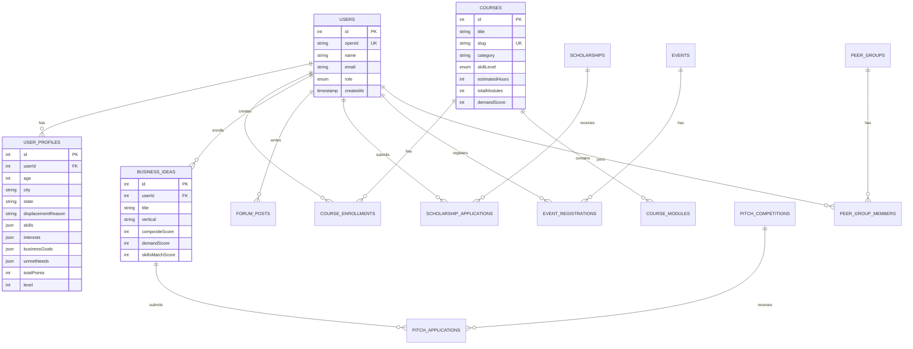

### Key Tables

| Table | Purpose | Records (Demo) |
|-------|---------|----------------|
| users | User authentication and identity | 50 |
| userProfiles | Extended user data and preferences | 50 |
| courses | Course catalog | 25 |
| courseEnrollments | User course progress | 150+ |
| businessIdeas | AI-generated business opportunities | 60+ |
| pitchCompetitions | Quarterly competitions | 4 |
| scholarships | Funding opportunities | 6 |
| events | Community events | 6 |
| forumPosts | Community discussions | 20 |
| peerGroups | Networking groups | 6 |

---

## Role-Based Access Control


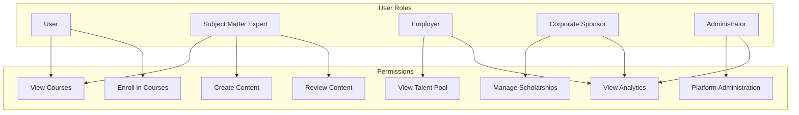

| Role | Description | Key Capabilities |
|------|-------------|------------------|
| User | Platform members (displaced women) | Course access, business tools, community |
| SME | Subject matter experts | Content creation, course review |
| Employer | Corporate talent seekers | Talent pool access, progress tracking |
| Sponsor | Corporate funding partners | Scholarship management, impact metrics |
| Admin | Platform administrators | Full platform access, analytics |

---

## Technical Stack

### Frontend
- **React 19** - UI framework with concurrent features
- **Tailwind CSS 4** - Utility-first styling
- **tRPC** - End-to-end type-safe APIs
- **Wouter** - Lightweight routing
- **Framer Motion** - Animations
- **Recharts** - Data visualization
- **shadcn/ui** - Component library

### Backend
- **Vercel Edge Functions** - Serverless API handlers
- **tRPC 11** - Type-safe API layer
- **Drizzle ORM** - Database toolkit
- **Neon PostgreSQL** - Serverless database
- **jose** - JWT session management
- **Google/GitHub OAuth** - Authentication

### AI/ML
- **OpenAI GPT-4** - Content generation
- **Claude 3** - Ethical review
- **Grok** - Market analysis
- **Vector embeddings** - Peer matching
- **OpenAI TTS** - Text-to-speech with "onyx" voice
- **Nova AI Assistant** - Context-aware global chatbot

### Infrastructure
- **Vercel** - Hosting and deployment
- **GitHub** - Version control
- **Vitest** - Testing framework

---

## API Documentation

### Authentication Endpoints

```typescript
// Get current user
trpc.auth.me.useQuery()

// Logout
trpc.auth.logout.useMutation()
```

### Course Endpoints

```typescript
// List all courses
trpc.course.list.useQuery({ category?, skillLevel?, search? })

// Get course details
trpc.course.get.useQuery({ id })

// Enroll in course
trpc.course.enroll.useMutation({ courseId })

// Update progress
trpc.course.updateProgress.useMutation({ enrollmentId, progress })
```

### Business Endpoints

```typescript
// Generate business ideas
trpc.business.generateIdeas.useMutation({ preferences })

// Get user's business ideas
trpc.business.getIdeas.useQuery()

// Generate business plan
trpc.business.generatePlan.useMutation({ ideaId })
```

### Community Endpoints

```typescript
// List forum posts
trpc.community.listPosts.useQuery({ category? })

// Create post
trpc.community.createPost.useMutation({ title, content, category })

// List peer groups
trpc.community.listGroups.useQuery()

// Join group
trpc.community.joinGroup.useMutation({ groupId })
```

### AI & Voice Endpoints

```typescript
// Global AI chat with context-aware responses
trpc.ai.chat.useMutation({ messages, context? })

// Business idea brainstorming
trpc.ai.brainstorm.useMutation({ skills, interests, capitalAvailable, timeAvailable })

// Document analysis
trpc.document.analyze.useMutation({ content, documentType })

// Text-to-speech synthesis
trpc.voice.synthesize.useMutation({ text, voice? })

// Real-time chat polling
trpc.chat.poll.query({ roomId, since })
```

---

## Deployment

### Prerequisites
- Node.js 20.x (Vercel compatible)
- pnpm 10+
- Neon PostgreSQL database
- Google Cloud Console (for OAuth)
- GitHub OAuth App (optional)

### Local Development

```bash
# Install dependencies
pnpm install

# Push database schema
pnpm db:push

# Seed demo data (optional)
node scripts/seed-data.mjs

# Start development server
pnpm dev
```

### Vercel Deployment

```bash
# Install Vercel CLI
npm i -g vercel

# Deploy to Vercel
vercel
```

### OAuth Configuration

#### Google OAuth Setup
1. Go to [Google Cloud Console](https://console.cloud.google.com/apis/credentials)
2. Create OAuth 2.0 Client ID (Web application)
3. Add authorized JavaScript origins:
   - `http://localhost:5173` (local dev)
   - `https://your-domain.com` (production)
4. Add authorized redirect URIs:
   - `http://localhost:5173/api/oauth/google/callback`
   - `https://your-domain.com/api/oauth/google/callback`

#### GitHub OAuth Setup (Optional)
1. Go to [GitHub Developer Settings](https://github.com/settings/developers)
2. Create new OAuth App
3. Set callback URL: `https://your-domain.com/api/oauth/github/callback`

### Environment Variables

| Variable | Description | Required |
|----------|-------------|----------|
| `DATABASE_URL` | Neon PostgreSQL connection string | ✅ |
| `JWT_SECRET` | Session signing secret (32+ chars, generate with `openssl rand -base64 32`) | ✅ |
| `GOOGLE_CLIENT_ID` | Google OAuth client ID | ✅ |
| `GOOGLE_CLIENT_SECRET` | Google OAuth client secret | ✅ |
| `VITE_GOOGLE_CLIENT_ID` | Same as GOOGLE_CLIENT_ID (for frontend) | ✅ |
| `GITHUB_CLIENT_ID` | GitHub OAuth client ID | ❌ |
| `GITHUB_CLIENT_SECRET` | GitHub OAuth client secret | ❌ |
| `VITE_GITHUB_CLIENT_ID` | Same as GITHUB_CLIENT_ID (for frontend) | ❌ |
| `VITE_APP_ID` | Application identifier (default: "nufounders") | ❌ |
| `OPENAI_API` | OpenAI API key for AI chat and TTS | ✅ |

### API Routes Structure

```
api/
├── oauth/
│   ├── google/
│   │   └── callback.ts    # Google OAuth callback handler
│   ├── github/
│   │   └── callback.ts    # GitHub OAuth callback handler
│   └── callback.ts        # Legacy unified callback
└── trpc/
    └── [trpc].ts          # tRPC edge function handler
```

---

## Future Roadmap

### Phase 2 (Q2 2026)
- [ ] Mobile app (React Native)
- [ ] Advanced AI tutoring
- [ ] Live video courses
- [ ] Mentorship matching
- [ ] Payment processing (Stripe)

### Phase 3 (Q3 2026)
- [ ] Franchise partnership portal
- [ ] B2B employer dashboard
- [ ] Advanced analytics
- [ ] Multi-language support
- [ ] SMS notifications

### Phase 4 (Q4 2026)
- [ ] AI-powered business coaching
- [ ] Investment marketplace
- [ ] Alumni network
- [ ] White-label solutions
- [ ] International expansion

---

## Support

For technical support or business inquiries:
- **Email**: support@nufounders.com
- **Website**: https://nufounders.com

---

## License

Copyright © 2026 NuFounders. All rights reserved.

---

*Built with ❤️ for displaced Black women entrepreneurs*
